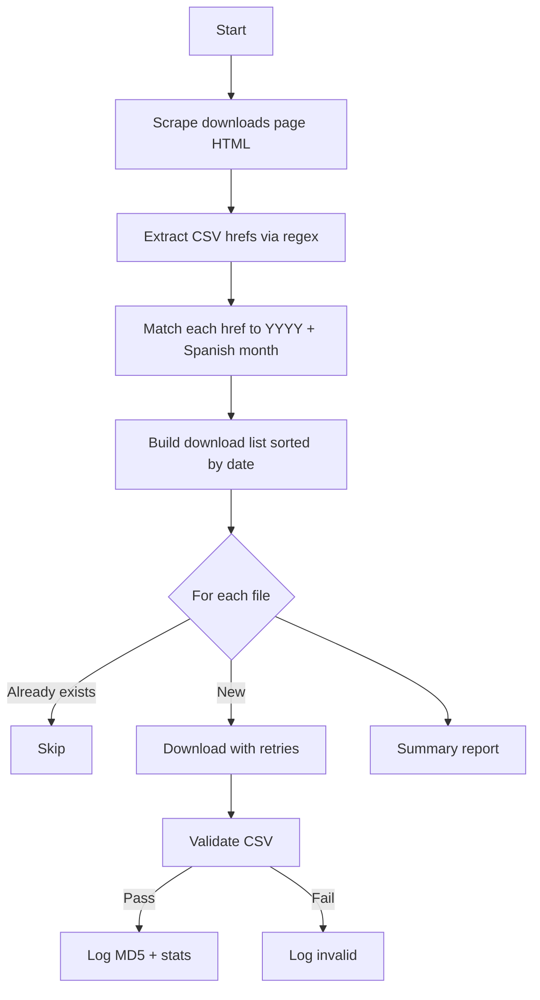

# Walkthrough: Madrid Traffic Data Download Script

## Overview

[download_madrid_traffic.py](file:///Users/Apple/Downloads/madrid_traffic_airquality/traffic_datasets/download_madrid_traffic.py) downloads monthly CSV files from the [Madrid permanent traffic counting stations dataset](https://datos.madrid.es/dataset/300233-0-aforo-trafico-permanentes).

## Architecture



## Key Components

| Component | Lines | Purpose |
|-----------|-------|---------|
| `MONTH_MAP` | 34–39 | Spanish → English month mapping |
| [setup_logging](file:///Users/Apple/Downloads/madrid_traffic_airquality/traffic_datasets/download_madrid_traffic.py#L51-L74) | 51–74 | Console + file logging |
| [fetch_csv_links](file:///Users/Apple/Downloads/madrid_traffic_airquality/traffic_datasets/download_madrid_traffic.py#L80-L176) | 80–176 | Scrapes HTML page, extracts CSV URLs with year/month metadata |
| [download_file](file:///Users/Apple/Downloads/madrid_traffic_airquality/traffic_datasets/download_madrid_traffic.py#L182-L207) | 182–207 | Retry-based file downloader (3 attempts, 5s delay) |
| [validate_csv](file:///Users/Apple/Downloads/madrid_traffic_airquality/traffic_datasets/download_madrid_traffic.py#L210-L267) | 210–267 | Checks: non-empty, has delimiters, min 2 lines |
| [compute_md5](file:///Users/Apple/Downloads/madrid_traffic_airquality/traffic_datasets/download_madrid_traffic.py#L270-L276) | 270–276 | File integrity hash |
| [main](file:///Users/Apple/Downloads/madrid_traffic_airquality/traffic_datasets/download_madrid_traffic.py#L282-L359) | 282–359 | Orchestrates discovery → download → validate loop |

## Scraping Strategy

The script scrapes the downloads page HTML rather than using hardcoded URLs:

1. **Find all CSV hrefs** matching pattern `300233-{id}-aforo-trafico-permanentes-csv`
2. **Look backwards** up to 2000 chars from each href to find the nearest `YYYY. Mes` label (e.g., "2025. Enero")
3. **Map** Spanish month names to English abbreviations via `MONTH_MAP`

## Output

Files saved to `traffic_datasets/traffic_csv/` as `YYYY_Mon_aforo_trafico.csv`:

```
2024_Jan_aforo_trafico.csv
2024_Feb_aforo_trafico.csv
...
2025_Jan_aforo_trafico.csv
```

## Usage

```bash
cd ~/Downloads/madrid_traffic_airquality/traffic_datasets
python3 download_madrid_traffic.py
```

## Comparison with Air Quality Script

| Feature | Traffic Script | Air Quality Script |
|---------|---------------|-------------------|
| URL discovery | HTML scraping | Hardcoded resource IDs |
| Data format | Individual CSVs per month | ZIP per year (2018–24) + single CSV (2025) |
| Output naming | `YYYY_Mon_aforo_trafico.csv` | `YYYY_Mon.csv` |
| Dry-run mode | ✗ | ✓ (`--dry-run`) |
| Year filter | ✗ | ✓ (`--year`) |
